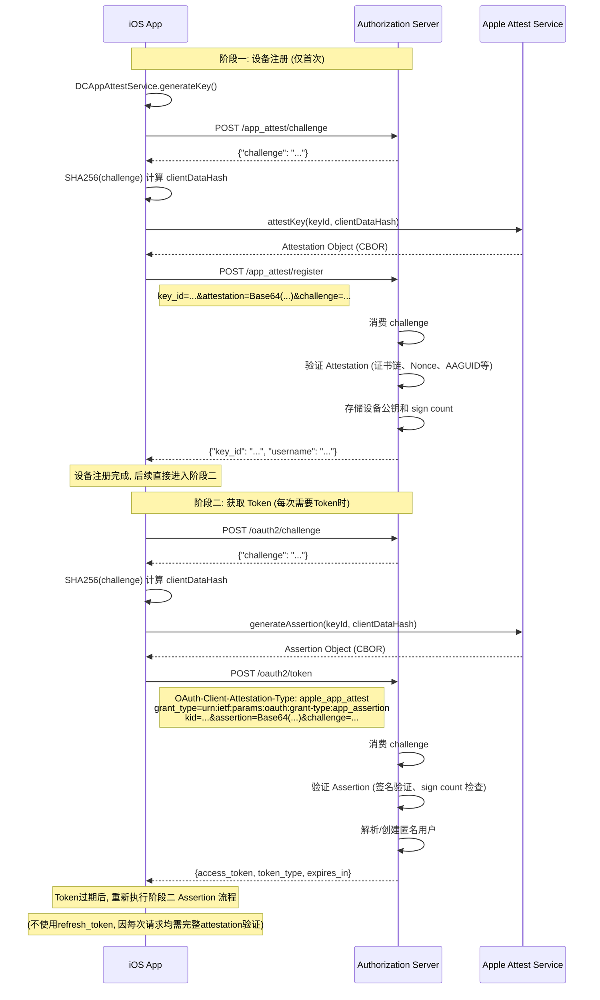

# Apple App Attest 接入文档

本文档描述 Apple Native App 如何利用 [Apple App Attest](https://developer.apple.com/documentation/devicecheck/establishing-your-app-s-integrity) 能力完成服务端的设备注册与 OAuth2 认证流程, 实现无账号登录并获取用户级 OAuth2 Token.

整个流程分为两个阶段:
1. **设备注册 (App Attestation)**: 首次使用时, 将设备公钥注册到服务端
2. **获取/续期 Token (App Assertion)**: 通过设备私钥签名证明身份, 获取用户级 Token

> **安全须知**: 所有敏感数据(Key ID、Token等)均应使用 Keychain 存储,
> **切勿**使用 `UserDefaults`、`plist` 或其他明文方式存储任何敏感信息, 因为这些存储方式在越狱设备上可被轻易读取.

---

## 阶段一: 设备注册 (App Attestation)

仅在首次使用时执行一次. 设备注册成功后, 后续直接进入阶段二获取Token, **切勿重新注册**, 因为重新注册会重新为该客户端创建用户, 原用户数据无法使用.

> 设备注册使用标准的 `Apple App Attest` 的 `Attestation` 流程, 即客户端同时提供自身公钥以及公钥的合法性证明, 服务端验证公钥合法后记录公钥信息, 并为该客户端创建一个匿名用户.

### 1.1 获取 Challenge

```http
POST /app_attest/challenge
```

无需认证, 无需请求体.

**Response:**
```json
{"challenge": "dGhpcyBpcyBhIHJhbmRvbSBjaGFsbGVuZ2U"}
```

### 1.2 生成 Attestation

客户端调用 Apple API 生成 Attestation Object:

```swift
let challengeData = Data(SHA256.hash(data: challenge.data(using: .utf8)!))
let attestation = try await DCAppAttestService.shared.attestKey(keyId, clientDataHash: challengeData)
```

### 1.3 注册设备

```http
POST /app_attest/register
Content-Type: application/x-www-form-urlencoded

key_id={keyId}&attestation={Base64编码的Attestation Object}&challenge={challenge}
```

|参数名|类型|说明|是否必填|
|---|---|---|---|
|key_id|string|`DCAppAttestService.generateKey()` 生成的 Key Identifier|是|
|attestation|string|Base64 编码的 Attestation Object|是|
|challenge|string|上一步获取的 challenge 原始值|是|

**Success Response (200):**
```json
{"key_id": "...", "username": "apple_app_..."}
```

**Error Response (401):**
```json
{"error": "registration_failed", "error_description": "..."}
```

---

## 阶段二: 获取 OAuth2 Token (App Assertion)

设备注册成功后, 通过 App Assertion (`grant_type=urn:ietf:params:oauth:grant-type:app_assertion`) 获取 Access Token.

> 获取 OAuth2 Token 使用 `OAuth 2.0 Attestation-Based Client Authentication` 草案规范, 结合 `Apple App Attest` 的 `Assertion` 流程验证客户端合法性, 并直接以客户端对应的匿名用户身份签发 Access Token.

### 2.1 获取 Challenge

```http
POST /oauth2/challenge
```

无需认证, 无需请求体.

**Response:**
```json
{"challenge": "dGhpcyBpcyBhIHJhbmRvbSBjaGFsbGVuZ2U"}
```

### 2.2 生成 Assertion

客户端调用 Apple API 生成 Assertion Object:

```swift
let challengeData = Data(SHA256.hash(data: challenge.data(using: .utf8)!))
let assertion = try await DCAppAttestService.shared.generateAssertion(keyId, clientDataHash: challengeData)
```

### 2.3 请求 Token

```http
POST /oauth2/token
OAuth-Client-Attestation-Type: apple_app_attest
Content-Type: application/x-www-form-urlencoded

grant_type=urn:ietf:params:oauth:grant-type:app_assertion&kid={keyId}&assertion={Base64编码的Assertion Object}&challenge={challenge}&scope=openid
```

**请求头:**

|头部|值|说明|
|---|---|---|
|OAuth-Client-Attestation-Type| `apple_app_attest` |指定使用 Apple App Attest 作为客户端证明方式|

**请求体参数:**

|参数名|类型|说明|是否必填|
|---|---|---|---|
|grant_type|enum|固定为 `urn:ietf:params:oauth:grant-type:app_assertion`|是|
|kid|string|设备 Key Identifier (与注册时的 `key_id` 相同)|是|
|assertion|string|Base64 编码的 Assertion Object|是|
|challenge|string|步骤 2.1 获取的 challenge 原始值|是|
|scope|string|申请的权限范围, 多个空格分隔|否|

**Success Response (200):**
```json
{
    "access_token": "eyJ...",
    "token_type": "Bearer",
    "expires_in": 299
}
```

> Token响应格式详见 [OAuth2 Token 接口文档](APIs-%23-OAuth2-Grant.md#response)


## 2.4 续期 Token

该 Grant Type 不签发 `refresh_token`. Token 过期后直接重新执行 2.1 到 2.3 的 Assertion 流程申请新 Token (获取 challenge → 生成 Assertion → 请求 Token)

> 原因: 每次请求 `/oauht2/token` 接口都需要跟初始获取一样携带 `Attestation-Based Client Authentication` 要求的请求头证明客户端身份, `refresh_token` 无法提供额外的安全价值, 反而增加存储和验证开销.

---

## 完整时序图



---

## 注意事项

* 每个 challenge 只能使用一次, 有效期5分钟, 过期或已使用的 challenge 会被拒绝
* `AccessToken` 过期后应重新执行阶段二 Assertion 流程获取新 Token
* 阶段一的注册只需执行一次, App 应在 Keychain 中持久化 Key ID
* 如果设备密钥丢失或需要重新注册, 需重新执行完整的阶段一流程
* **重要!!** 设备重新注册后, 会创建新的用户, 无法使用原用户数据.

## 相关文档

* [Establishing Your App's Integrity](https://developer.apple.com/documentation/devicecheck/establishing-your-app-s-integrity)
* [Validating Apps That Connect to Your Server](https://developer.apple.com/documentation/devicecheck/validating-apps-that-connect-to-your-server)
* [OAuth 2.0 Attestation-Based Client Authentication (Draft）](https://datatracker.ietf.org/doc/html/draft-ietf-oauth-attestation-based-client-auth-08)
